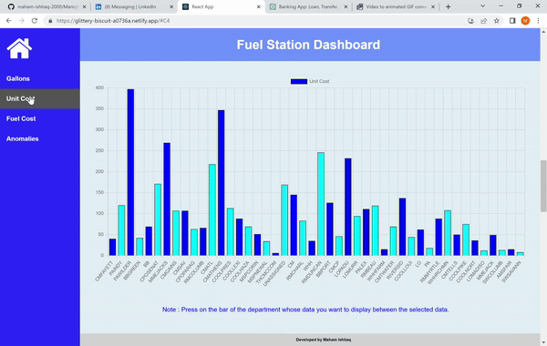

# Fuel Station Dashboard

This application is built using the MERN stack technology, enabling administrators to efficiently track fuel consumption by drivers across various apartments. It provides a comprehensive system for managing and monitoring fuel usage, promoting effective resource management and accountability.


## Project GIF

<div class="gif-container" style="display: flex; justify-content: center; margin-left: auto; margin-right: auto;">
    
</div>

## 🚀 Demo

<a href="https://rahuldkjain.github.io/gh-profile-readme-generator" target="blank">

</a>

Try the application: https://glittery-biscuit-a0736a.netlify.app/
### Backend Code: https://github.com/maham-ishtiaq-2000/FuelStationBackend


## 🛠️ Installation Steps

1. Clone the repository

```bash
git clone https://github.com/maham-ishtiaq-2000/Fuel-Station-Dashboard.git
```

2. Change the working directory

```bash
cd Fuel-Station-Dashboard.git
```

3. Install dependencies

```bash
npm install --force
```

4. Run the app

```bash
npm start
```

🌟 You are all set!

## 💻 Built with

- [React] for UI and frontEnd part of application
- [Express JS] for REST API's
- [Node JS] for backend part of application
- [MongoDB] for adding database
